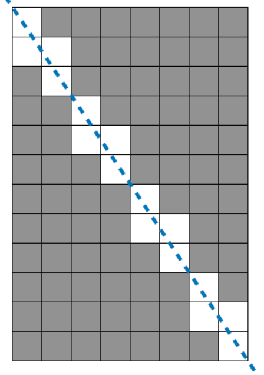

# 멀쩡한 사각형

```java
class Solution {
	
    public long solution(int w, int h) {
    	long w1 = w;
    	long h1 = h;
    	long gcd = gcd(Math.max(w1, h1),Math.min(w1, h1));
    
    	return (w1*h1)-(((w1 / gcd) + (h1 / gcd) - 1) * gcd);
    }
    
    public static long gcd(long a, long b) {
    	
    	if(a%b == 0) {
    		return b;
    	}
    	
    	return gcd(b, a%b);
    }
}
```



| W    | H    | result |
| ---- | ---- | ------ |
| 8    | 12   | 80     |

GCD(W,H) => 4가 도출됨.

패턴의 개수 4개 => (W / GCD) + (H / GCD) -1 이 패턴안의 공백 개수 


