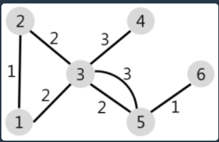

# 배달

```java
import java.util.ArrayList;
import java.util.HashMap;
import java.util.PriorityQueue;

class Solution {
	
	public static class Node implements Comparable<Node> {
		
		String vertex;
		int weight;
		
		public Node(String vertex, int weight) { //생성자에는 반환자가 안붙음
			this.vertex = vertex;
			this.weight = weight;
		}
		
		@Override
		public int compareTo(Node n) {
			return this.weight - n.weight; //작은 가중치가 먼저 앞으로옴
		}
	}
	
	public int solution(int N, int[][] road, int K) {
        int answer = 0;
        
        HashMap <String, ArrayList<Node>>connect_Info = create_Connection(N,road);
        //일반적인 큐만 LinkedList로 만듬
        
        HashMap <String, Integer> current = new HashMap();
        PriorityQueue <Node>que = new PriorityQueue();
        Node Start_node = new Node("1",0);
        que.add(Start_node);
        current.put("1", 0);
        
        for(int i=2; i<=N; i++) {
        	current.put(Integer.toString(i), 500001);
        }
        
        while(!que.isEmpty()) {
        	Node visit = que.poll();
        	
        	if(current.get(visit.vertex) < visit.weight) { //다른 노드에의해서 방문이 이뤄졌는가?
        		continue;
        	}
        	//아니라면 방문.
        	ArrayList <Node> attached = connect_Info.get(visit.vertex);
        	
        	for(Node gp : attached) {
        		int new_Weight = current.get(visit.vertex) + gp.weight;
        		
        		if(current.get(gp.vertex) > new_Weight) {
        			current.put(gp.vertex, new_Weight);
        			que.add(new Node(gp.vertex,new_Weight));
        		}
        	}
        }
   
        return (int)current.values().stream().filter(i-> i <= K).count();
    }
	
	public static HashMap<String, ArrayList<Node>> create_Connection(int N, int [][]road){
		
		HashMap <String, ArrayList<Node>> connections = new HashMap();
		
		for(int i=1; i<=N; i++) {
			ArrayList<Node> temp = new ArrayList();
			
			for(int j=1; j<=N; j++) {
				if(j==i) {
					Node graph = new Node(Integer.toString(j),0);
					temp.add(graph);
					continue;
				}
				Node graph = new Node(Integer.toString(j),500001);
				temp.add(graph);
			}
			
			connections.put(Integer.toString(i), temp);
		}
		
		for(int []temp : road) {
			Node first = connections.get(Integer.toString(temp[0])).get(temp[1]-1);
			Node Second = connections.get(Integer.toString(temp[1])).get(temp[0]-1);
			
			if(first.weight > temp[2]) {
				first.weight = temp[2];
			}
			if(Second.weight > temp[2]) {
				Second.weight = temp[2];
			}
		}
		
		return connections;
	}
}
```


### 다익스트라 알고리즘의 표본.

**한 노드 지점에서 각 노드에 이르는 최소거리를 찾고 싶을때 사용하는 알고리즘**


1번 노드의 연결상태 (자기 자신과의 거리는 0으로 초기화)

. . . . .

2번 노드의 연결상태 (자기 자신과의 거리는 0으로 초기화)

. . . . .

3번 노드의 연결상태 (자기 자신과의 거리는 0으로 초기화)

. . . . .


노드 연결상태를 만들어 준 후에 road 거리 데이터를 참조하여 자신과 연결되지 않은 노드의 인덱스에 해당하는 값은 "Infinity" / 연결된 값은 데이터에 해당하는 값으로 전환한다.


```java
@Override
public int compareTo(Node n) {
		return this.weight - n.weight; //작은 가중치가 먼저 앞으로옴
}
```


위 노드 구현자에 해당하는 compareTo 메소드. 해당 메소드는 Priorityque에서 정렬 참조를 위해 사용된다.

==> 작은 가중치가 먼저 앞으로 오게 설정했으므로 Minheap이 됨. 

(다익스트라 알고리즘의 체계중 하나) 연결된 노드를 꺼낼때 최소 가중치를 먼저 적용함.


```java
HashMap <String, Integer> current = new HashMap();
```

해당하는 위의 데이터 구조는 현재 피봇이 될 노드에서의 각 그래프에 이어지는 최단 거리를 저장할 장소.


```java
Node Start_node = new Node("1",0);
que.add(Start_node);
current.put("1", 0);
```

Pivot을 설정하는 방식. ==> 언제든지 이 Pivot은 사용자에 의해 달라질 수 있다.





```java
if(current.get(visit.vertex) < visit.weight) { //다른 노드에의해서 방문이 이뤄졌는가?
        continue;
}
        	//아니라면 방문.
ArrayList <Node> attached = connect_Info.get(visit.vertex);
        	
for(Node gp : attached) {
       int new_Weight = current.get(visit.vertex) + gp.weight;
        		
       if(current.get(gp.vertex) > new_Weight) {
        	current.put(gp.vertex, new_Weight);
        	que.add(new Node(gp.vertex,new_Weight));
        }
}
```


3에서 5로 진행할때 거리가 3 / 2... 등 여러번 연결되어있을 수 있다. "5"라는 해당 노드에 이르는 최단거리와 현재 5로 진행되는 루트에서의 총거리를 비교해서 이미 최단거리로 방문한 곳을 다시 방문하는 에러를 막는다.


만약 방문하지 않은 곳이라면 해당 지금 방문한 노드에서 연결된 모든 노드들을 가져와 (여기에는 연결되지 않은 노드도 포함될 수 있다. 하지만 Infinity 값을 가지므로 que에 포함될 수 없는 구조.) 현재 방문한 거리 + 곧 방문할 노드에 이르는 거리 즉 new_Weight 값과 최단 거리를 저장하는 맵에 인덱스 해당하는 값과 비교하여서 아직 Infinity이면 방문하지 않은 것이므로 최단거리로 변환시켜주고 Queue에 넣은 후 작은 가중치를 가진 것부터 먼저 판별하는 형식이다. 


위 공식은 Queue가 비어질때까지 계속된다. 

 


