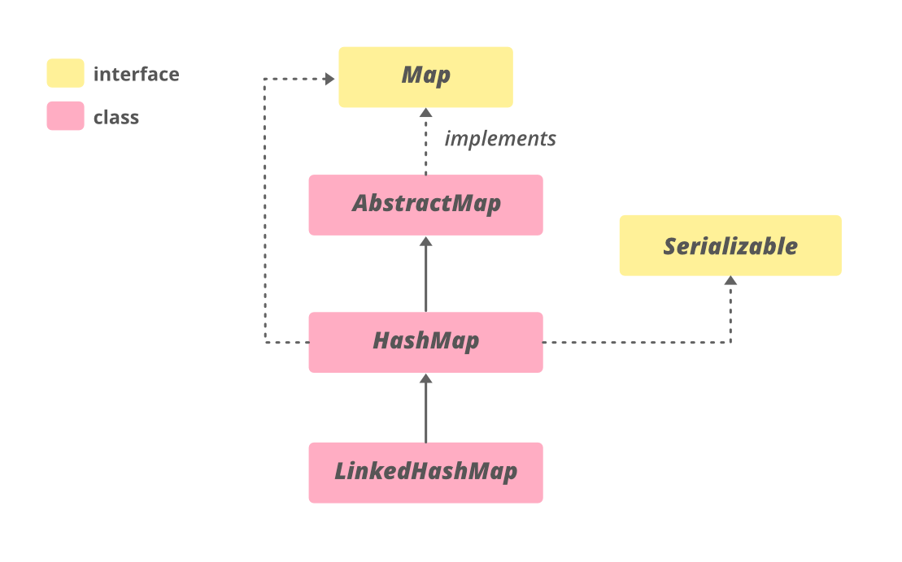

# 완주하지 못한 선수

#### 정의

**Hash를 활용한 O(1) 시간 효율성 활성화**

```java
import java.util.HashMap;

class Solution {
	public String solution(String[] participant, String[] completion) {
		String answer = "";
		HashMap<String, Integer> temp = new HashMap(participant.length);
		
		for(String mv : completion){temp.put(mv,temp.getOrDefault(mv, 0)+1);}
		for(String mv : participant)
		{
			int con = temp.getOrDefault(mv,0);
			if(con != 0)
				temp.put(mv, --con);
			else{	
                answer = mv;
                 break;
			    }
		}		
		return answer;
	}
}
```




* Search, Insert, Delete : O(1)
* 처음은 일반적인 String.equals()를 활용한 단순 비교지만, O(n)의 성능을 소유하기 때문에 비효율적이라 판단됨.
  * 궁극적으로, HashMap() 을 활용한 O(1)의 효율을 달성함으로써 문제를 해결한다.
  * Bucket의 제한된 공간으로 인해, f(key)값이 Collsion이 된다면 결과적으로 이를 해결하기 위한 방법을 모색해야한다. 그것은 Chain(Linked-List), Unchain 방법들이 존재.

### 메소드

- put(key, Value) ==> Key와 Value를 정해서 입력하게 된다. 중요한건 Key는 **겹치게 된다면**, 그 키의 현존하던 Value값을 덮어 씌우게 된다는 것이다.
- remove(key) ==> Key값과 Value값을 동시에 삭제.
- clear() ==> 모든 값 삭제.
- get(key) ==> key에 해당하는 Value 값을 획득한다.
- containsKey(key) ==> key값을 가지고 있는가. (Boolean)
- size() ==> 얼마나 많은 Entry(key, Value)들을 가지고 있는가.
- getOrDefault(Key, Default) ==> 만약, Key값이 존재한다면 지칭된 값을 반환하지만 아니라면 설정한 Default값을 반환한다.
- putifAbsent(key, value) ==> Key값이 존재한다면 연관된 값을 반환하지만, 아니라면 값을 집어넣고 Null을 반환한다.